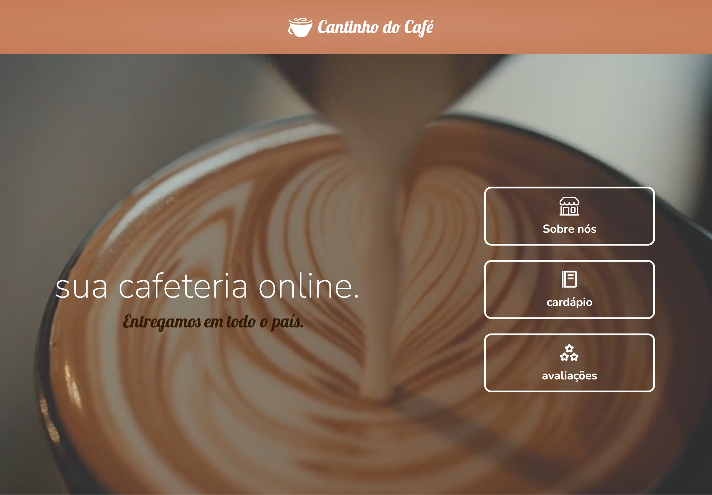
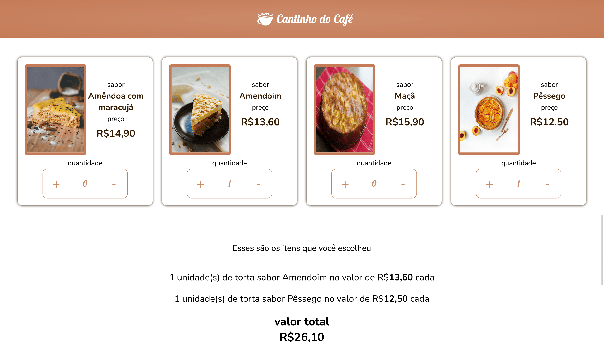
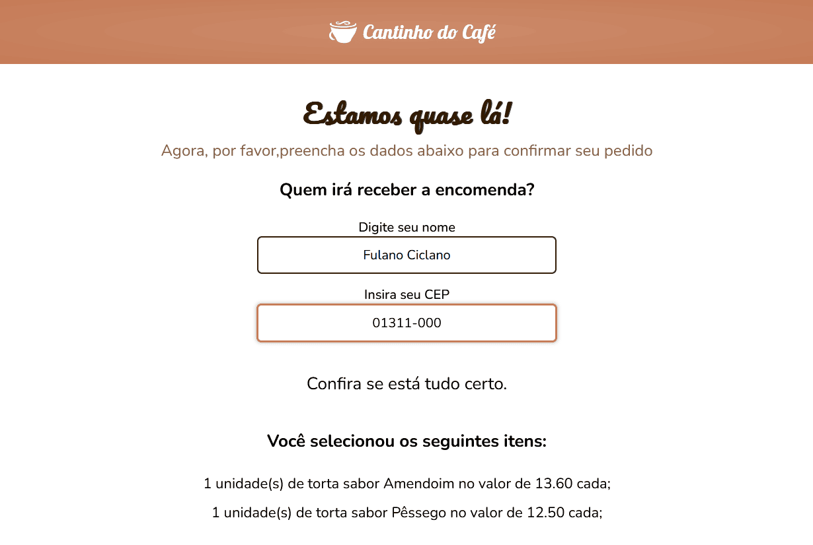
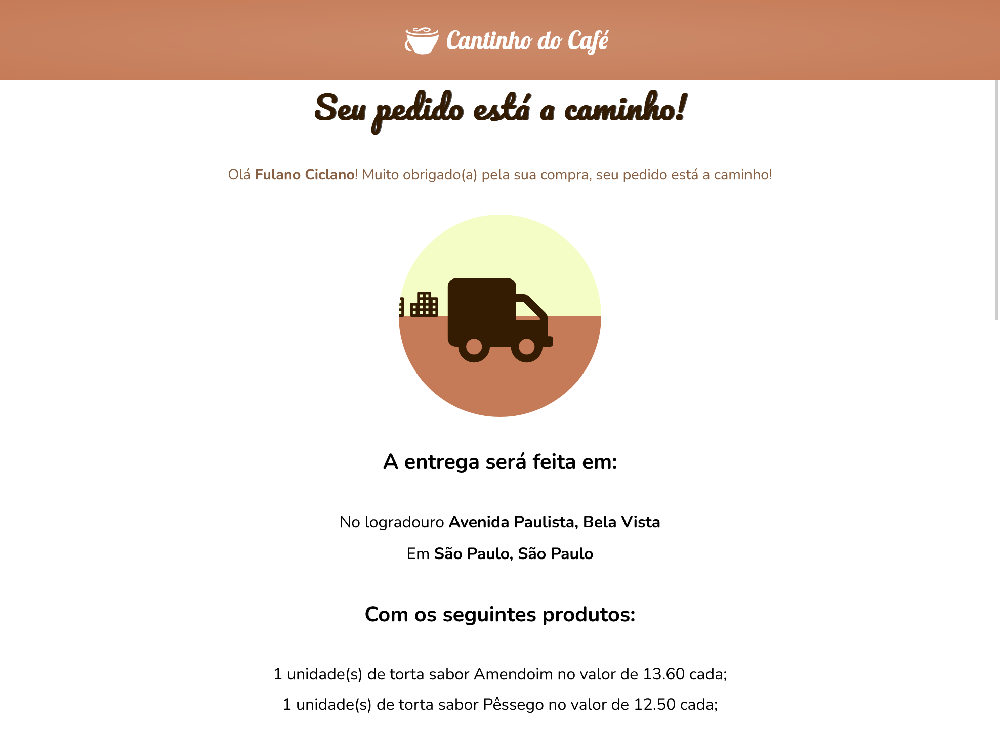
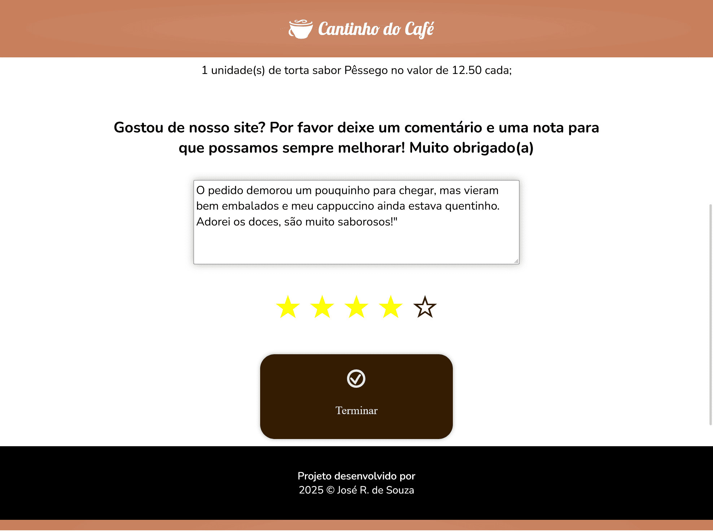
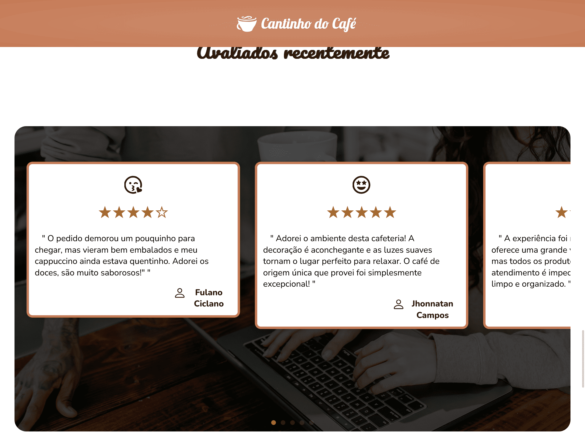

# Projeto Site Cafeteria Cantinho do Café
__status: EM DESENVOLVIMENTO__

 O site é uma cafeteria/doceria virtual que oferece várias opções de bebidas e doces, além de contar com a simulação de entrega.

OBS: Este site foi desenvolvido para fins de aprendizado, portanto a marca é ficticia.

Link do projeto:

## Tecnologias
<ul>
    <li>HMTL5;</li>
    <li>CSS3;</li>
    <li>JavaScript;</li>
    <li>React;</li>
    <li>Swiper</li>
</ul>

## Como Navegar:

No cabeçalho da página inicial, o usuário tem três opções: __Sobre nós__, __Cardápio__ e __Avaliações__. Ao clicar em cada um, a página irá “scrollar” até a seção correspondente. No caso do botão de __Cardápio__, o usuário se deparará com uma arte de giz.

 Abaixo do cardápio, haverá um botão que, se clicado, redirecionará para a página onde o usuário poderá __selecionar a quantidade dos itens desejados e consultar o valor__. 

 
 
 
 
  
 
 Abaixo da lista de itens selecionados, aparecerá um botão de __confirmar__ e, após clica-lo, o usuário prosseguirá para a página de confirmação. Nesta, será pedido o nome e CEP para simular a entrega.

  

 

  

Por fim, na página seguinte, o usuário poderá ver uma pequena animação feita com CSS os dados da “entrega”. Há um campo de comentário e a opção de dar uma nota clicando nas estrelas. Ao fazer isso, na página inicial, na seção de comentários, __irá aparecer uma caixa__ no canto esquerdo onde estará o __nome, comentário, e a nota de avaliação__ determinados anteriormente. Um emoji também será exibido, de acordo com a nota que o cliente der.

 

 

 

 

 

